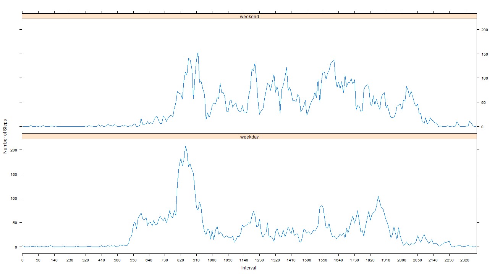

# Reproducible Research: Peer Assessment 1

=====================================================================

## Loading and preprocessing the data

#### Reading data

```r
data <- read.csv(unzip("activity.zip"))
str(data)
```

```
## 'data.frame':	17568 obs. of  3 variables:
##  $ steps   : int  NA NA NA NA NA NA NA NA NA NA ...
##  $ date    : Factor w/ 61 levels "2012-10-01","2012-10-02",..: 1 1 1 1 1 1 1 1 1 1 ...
##  $ interval: int  0 5 10 15 20 25 30 35 40 45 ...
```

#### Preprocessing data

```r
library(plyr)
summary_by_date <- ddply(data,~date,
                         summarise,
                         total_steps=sum(steps, na.rm=TRUE),
                         mean_steps_per_interval=mean(steps, na.rm=TRUE))

data$interval <- as.factor(data$interval)
summary_by_interval <- ddply(data,~interval,
                         summarise,
                         total_steps=sum(steps, na.rm=TRUE),
                         mean_steps=mean(steps, na.rm=TRUE))
```

#### Summary of new data tables:

```r
str(summary_by_date)
```

```
## 'data.frame':	61 obs. of  3 variables:
##  $ date                   : Factor w/ 61 levels "2012-10-01","2012-10-02",..: 1 2 3 4 5 6 7 8 9 10 ...
##  $ total_steps            : int  0 126 11352 12116 13294 15420 11015 0 12811 9900 ...
##  $ mean_steps_per_interval: num  NaN 0.438 39.417 42.069 46.16 ...
```

```r
str(summary_by_interval)
```

```
## 'data.frame':	288 obs. of  3 variables:
##  $ interval   : Factor w/ 288 levels "0","5","10","15",..: 1 2 3 4 5 6 7 8 9 10 ...
##  $ total_steps: int  91 18 7 8 4 111 28 46 0 78 ...
##  $ mean_steps : num  1.717 0.3396 0.1321 0.1509 0.0755 ...
```

## What is mean total number of steps taken per day?

#### Computing Mean and Median

```r
mean_of_steps_per_day <- round(mean(summary_by_date$total_steps, na.rm=TRUE), 2)
median_of_steps_per_day <- median(summary_by_date$total_steps, na.rm=TRUE)
```

* Mean of total number of steps each day:  9354.23 
* Median of total number of steps each day: 10395

#### Histogram of Total Number of Steps each Day

```r
hist <- hist(summary_by_date$total_steps, 
     main = "Histogram of Total Steps per Day", breaks=20,
     xlab = "Total Steps each Day",
     ylab = "Frequency (days)",
     ylim = c(0,10),
     col = "BLUE",
     xaxt = "n")
axis(side=1, at=seq(0, 22000, 1000), lab=seq(0, 22000, 1000))
abline(v=mean_of_steps_per_day, col="BLACK", lty=2, lwd=2)
abline(v=median_of_steps_per_day, col="BLACK", lty=3, lwd=2)
legend("topright", legend=c("Mean", "Median"), col=c("BLACK", "BLACK"), lty=c(2,3), lwd=2)
```

 

## What is the average daily activity pattern?

#### Finding interval with maximum steps on an average

```r
max_steps <- round(max(summary_by_interval$mean), digits=2)
max_index <- which.max(summary_by_interval$mean)
max_interval <- summary_by_interval$interval[max_index]
max_interval <- as.numeric(as.character(max_interval))
```

* The interval with the maximum number of steps is the 835th interval with 206.17 steps everyday on an average

#### Time Series Plot : Average Number of Steps(y) Vs. Interval(x)


```r
plot(as.numeric(summary_by_interval$interval), summary_by_interval$mean, 
     type = "l", 
     col = "BLUE",
     main = "Average Steps per Interval", 
     xlab = "Interval",
     ylab = "Average Number of Steps (over all days)",
     xaxt = "n", 
     yaxt = "n")
axis(side=1, at=seq(1,288,4), labels=summary_by_interval$interval[seq(1,288,4)])
axis(side=2, at=seq(0,250,15), labels=seq(0,250,15))
abline(v=max_index, lwd=1, col="BLACK", lty=2)
abline(h=max_steps, lwd=1, col="BLACK", lty=2)
text(x=max_index+10, y=max_steps+4, labels=paste("(",max_interval,",",max_steps,")"))
```

 

## Imputing missing values

#### Computing total number of incomplete cases in the dataset

```r
no_of_incomplete_cases <- nrow(data) - sum(complete.cases(data))
```
* Number of incomplete rows are 2304 out of 17568 observations

### Creating new data set with filled in values
* Strategy :
  * Replace NA values of incomplete cases with Mean of the number of steps for that interval 
  * If Mean of the number of steps is NaN, it will again result in incomplete cases. These are replaced by 0

```r
newdata <- data
newdata[!complete.cases(newdata),]$steps <- round(summary_by_interval[!complete.cases(newdata),]$mean_steps,2)
newdata[!complete.cases(newdata),]$steps <- 0
```

#### Preprocessing newdata

```r
new_summary_by_date <- ddply(newdata,~date,
                         summarise,
                         total_steps=sum(steps, na.rm=TRUE),
                         mean_steps_per_interval=mean(steps, na.rm=TRUE))

newdata$interval <- as.factor(newdata$interval)
new_summary_by_interval <- ddply(newdata,~interval,
                         summarise,
                         total_steps=sum(steps, na.rm=TRUE),
                         mean_steps=mean(steps, na.rm=TRUE))
```

#### Computing Mean and Median

```r
new_mean_of_steps_per_day <- round(mean(new_summary_by_date$total_steps, na.rm=TRUE), 2)
new_median_of_steps_per_day <- median(new_summary_by_date$total_steps, na.rm=TRUE)
```

* Mean of total number of steps each day:  9530.72 
* Median of total number of steps each day: 1.0439 &times; 10<sup>4</sup>  
    * Mean shifts by 176.49 steps to the right
    * Median shifts 44 steps to the right
    * The distribution remains almost the same

#### Histogram of Total Number of Steps each Day using Filled-In Data

```r
newhist <- hist(new_summary_by_date$total_steps, 
     main = "Histogram of Total Steps per Day Using Filled In Data", breaks=20,
     xlab = "Total Steps each Day",
     ylab = "Frequency (days)",
     ylim = c(0,10),
     col = "BLUE",
     xaxt = "n")
axis(side=1, at=seq(0, 22000, 1000), lab=seq(0, 22000, 1000))
abline(v=new_mean_of_steps_per_day, col="BLACK", lty=2, lwd=2)
abline(v=new_median_of_steps_per_day, col="BLACK", lty=3, lwd=2)
legend("topright", legend=c("Mean", "Median"), col=c("BLACK", "BLACK"), lty=c(2,3), lwd=2)
```

 


## Are there differences in activity patterns between weekdays and weekends?

```r
weekdays <- c("Monday", "Tuesday", "Wednesday", "Thursday", "Friday")
weekends <- c("Saturday", "Sunday")
newdata$day_of_week <- weekdays(as.Date(newdata$date))

# add a weekend/weekday column to newdata
newdata[newdata$day_of_week %in% weekends,]$day_of_week <- "weekend"
newdata[newdata$day_of_week %in% weekdays,]$day_of_week <- "weekday"

# creating factor variable
newdata$day_of_week <- as.factor(newdata$day_of_week)

# summarising with respect to two factor variables
weekdata <- ddply(newdata, .(interval, day_of_week), 
                                      summarise,
                                      total_steps=sum(steps, na.rm=TRUE),
                                      mean_steps=round(mean(steps, na.rm=TRUE),2))  

# lattice panel plot
library(lattice)
xyplot(mean_steps ~ interval | day_of_week, 
       data = weekdata, 
       layout = c(1,2), 
       type = "l", 
       ylab = "Number of Steps",
       xlab = "Interval", 
       scales=list(
          x=list(
                  at=seq(1,288,10), 
                  labels=weekdata$interval[seq(1,288,10)]
    )))
```

 

* Inferences from the above plot :
  * The activity pattern remains somewhat similar with peaks and drops within the same interval range
  * The number of steps on an average per interval is mostly lesser during the weekend.
  * The increase in the number of steps is earlier during weekdays as compared to weekends i.e approximately 255th interval on weekdays and 355th interval on weekdays - around an hour later
